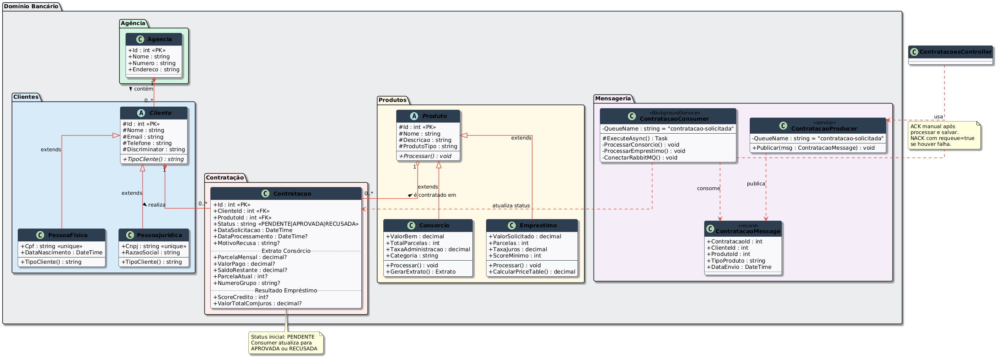
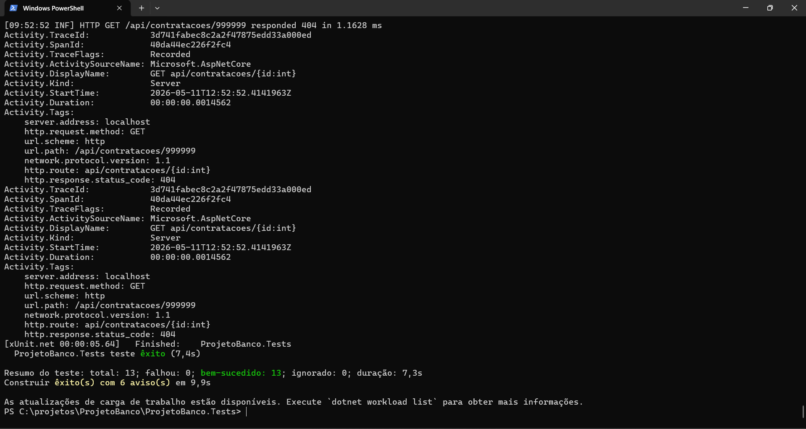
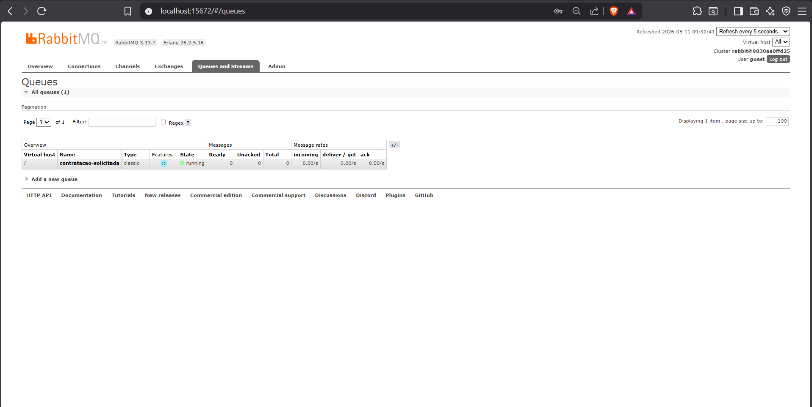
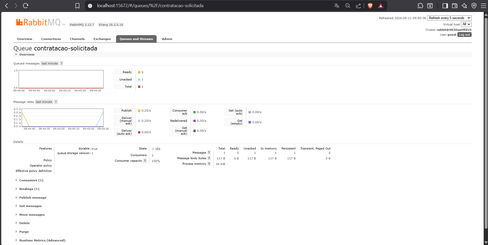
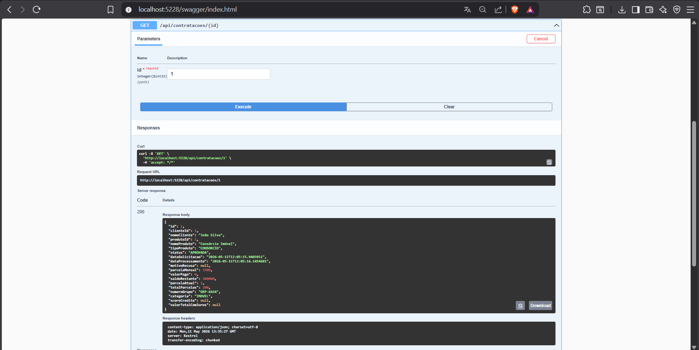

# Projeto Banco - API com Mensageria (Checkpoint 5)

Este projeto consiste no desenvolvimento do backend de um banco digital voltado para o processamento assíncrono de contratações de produtos bancários, utilizando a stack .NET 8, Oracle Database e RabbitMQ.

## 1. Identificação
* **Nome:** Jhonatta Lima Sandes de Oliveira
* **RM:** 560277
* **Turma:** 2TDSPA

## 2. Produto Bancário Escolhido e Justificativa
Foram implementados os produtos de **Consórcio** e **Empréstimo**.
* **Justificativa:** A escolha visa demonstrar a capacidade do sistema em lidar com regras de negócio distintas. O **Consórcio** exige cálculos de parcelamento linear e gestão de grupos, enquanto o **Empréstimo** implementa uma análise de risco baseada em *score* de crédito e cálculos de juros compostos, evidenciando a robustez do processamento assíncrono para diferentes domínios financeiros.

## 3. Decisão de Modelagem de Filas
O projeto utiliza a abordagem de **Fila Única (`contratacao-solicitada`) com Discriminator no Payload**.
* **Justificativa:** Esta decisão foi tomada para centralizar o tráfego de solicitações, facilitando o monitoramento e a escalabilidade inicial. O `ContratacaoConsumer` atua como um orquestrador que, ao ler o discriminator `TipoProduto` da mensagem, direciona o processamento para a lógica específica (Consórcio ou Empréstimo). Isso reduz a sobrecarga de gerenciamento de múltiplas conexões e canais no RabbitMQ para este escopo.

## 4. Diagrama de Classes
O diagrama reflete a herança da entidade abstrata `Cliente` para `PessoaFisica` e `PessoaJuridica`, além da relação entre `Agencia`, `Cliente` e `Contratacao`.



## 5. Como Rodar Localmente

### Pré-requisitos
* .NET SDK 8.0+
* Docker Desktop
* Ferramenta de linha de comando `dotnet-ef`

### Execução
1.  **Subir RabbitMQ e Jaeger (Docker):**
    ```bash
    docker-compose up -d
    ```
    *Isso iniciará o RabbitMQ na porta 5672 (e painel na 15672) e o Jaeger na 4318.*

2.  **Configurar o Banco de Dados:**
    Atualize a `DefaultConnection` no arquivo `appsettings.json` com suas credenciais do Oracle FIAP.

3.  **Atualizar Base de Dados:**
    ```bash
    dotnet ef database update --project ProjetoBanco.API
    ```

4.  **Executar a Aplicação:**
    ```bash
    dotnet run --project ProjetoBanco.API
    ```

## 6. Endpoints Disponíveis

### Clientes
* **POST** `/api/clientes/pf`: Cadastra Pessoa Física.
    * *Payload:* `{ "nome": "João", "email": "joao@email.com", "telefone": "119...", "cpf": "123.456.789-00", "dataNascimento": "1990-01-01", "agenciaId": 1 }`
* **POST** `/api/clientes/pj`: Cadastra Pessoa Jurídica.
* **GET** `/api/clientes/{id}`: Detalhes do cliente e agência vinculada.

### Contratações (Fluxo Assíncrono)
* **POST** `/api/contratacoes`: Solicita um produto.
    * *Request:* `{ "clienteId": 1, "produtoId": 3 }`
    * *Response (202 Accepted):* Retorna os dados iniciais com status `PENDENTE`.
* **GET** `/api/contratacoes/{id}`: Consulta o status final após o processamento pelo *Background Service*.

## 7. Testes Automatizados
O projeto possui testes unitários e integrados utilizando `WebApplicationFactory`, `Moq` e banco em memória `InMemory`.
* **Execução:** `dotnet test`



## 8. Evidências de Funcionamento

### Painel RabbitMQ (Fila e Unacked)
Abaixo, a comprovação do recebimento de mensagens e o estado da fila:





### Swagger e Aprovação
Exemplo de contratação processada com sucesso (`APROVADA`):


---
**Nota sobre Observabilidade:** A API está configurada com OpenTelemetry enviando traces para o Jaeger (porta 4318).
